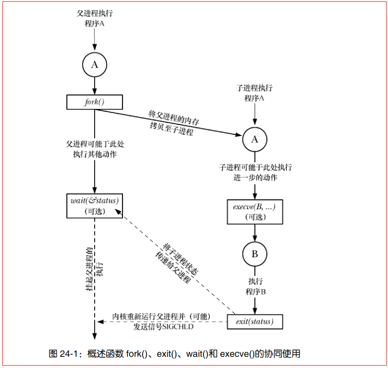
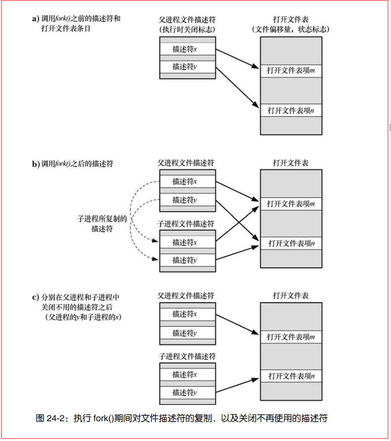

- [fork()、exit()、wait()以及execve()的简介-\>important](#forkexitwait以及execve的简介-important)
  - [fork()、exit()、wait()以及execve()关系图](#forkexitwait以及execve关系图)
- [创建新进程：fork()](#创建新进程fork)
  - [父、子进程间的文件共享](#父子进程间的文件共享)
  - [fork()的内存语义](#fork的内存语义)
    - [控制进程的内存需求](#控制进程的内存需求)
- [系统调用vfork()](#系统调用vfork)
- [fork()之后的竞争条件（Race Condition）](#fork之后的竞争条件race-condition)
- [同步信号以规避竞争条件](#同步信号以规避竞争条件)
- [总结](#总结)

# fork()、exit()、wait()以及execve()的简介->important

> - 系统调用 **fork()**

- 允许一进程（父进程）创建一新进程（子进程）。
- 新的子进程几近于对父进程的翻版：**子进程获得父进程的栈、数据段、堆和执行文本段（6.3 节）的拷贝**

> - 库函数 **exit（status）**

- 终止一进程，**将进程占用的所有资源（内存、文件描述符等）归还内核**，交其进行再次分配。
- 参数 status 为一整型变量，表示进程的退出状态。父进程可使用系统调用wait()来获取该状态。

> - 系统调用**wait（&status**）

- 如果子进程尚未调用 exit()终止，那么**wait()会挂起父进程直至子进程终止；**
- **子进程的终止状态通过wait()的status 参数返回**

> - 系统调用 **execve(pathname，argv，envp)**

- 加载一个新程序（路径名为 pathname，参数列表为 argv，环境变量列表为 envp）到当前进程的内存。
- 这将**丢弃现存的程序文本段，并为新程序重新创建栈、数据段以及堆**
- 通常将这一动作**称为执行（execing）一个新程序**
  
## fork()、exit()、wait()以及execve()关系图
> 
> - 图中对execve()的调用并非必须。
> - 最终,总是要**通过调用exit()（或接收一个信号）来终止子进程**，而父进程可调用wait()来获取其终止状态。


---
# 创建新进程：fork()
> **`pid_t fork(void);`**
> - **父进程：成功fork返回子进程的pid，失败返回-1**
> - **子进程（成功fork后）：返回0**

-  两个进程
   -  执行**相同**的**程序文本段**
   -  拥有**不同**的**栈段、数据段以及堆段拷贝**
   - 子进程的栈、数据以及栈段开始时是对父进程内存相应各部分的**完全复制**
   - 执行 fork()之后，每个进程**均可修改各自的栈数据、以及堆段中的变量**，而并不影响另一进程

- 获取pid（ID）
  - 子进程：可调用**getpid()以获取自身的进程ID**，调用**getppid()以获取父进程ID**
  - 父进程：可调用getpid()以获取自身的进程ID

```c
pid_t pid = fork();
        if (pid < 0)
        {
            perror("fork()");
            exit(1);
        }
        else if (pid == 0) // 子进程
        {
            execvp(argv[0], argv); // 执行命令
            perror("execvp()");
            exit(1);
        }
        else if (pid > 0) // 父进程
        {
            waitpid(pid, NULL, 0);
        }
```

## 父、子进程间的文件共享
>概念
- 执行fork()时，子进程会获得父进程所有文件描述符的副本。这些副本的创建方式类似于dup()，这也意味着**父、子进程中对应的描述符均指向相同的打开文件句柄**（即 open  file description)
- 打开文件句柄包含有当前文件偏移量（由read()、write()和lseek()修改）以及文件状态标志（由open()设置，通过fcntl()的F_SETFL 操作改变）
- **如果子进程更新了文件偏移量，那么这种改变也会影响到父进程中相应的描述符。**
> 应用
- 父、子进程间的文件共享导致父子进程的输出随意混杂在一起，要想规避这一现象，需要**进行进程间同步**
  - **父进程可以使用系统调用 wait()来暂停运行并等待子进程退出**
  - 如shell，当执行命令的子进程退出后，shell 才会打印出提示符



## fork()的内存语义
- fork()之后常常伴随着 exec(),  这会用新程序替换进程的代码段，并重新初始化其数据段、堆段和栈段
- 内核（Kernel）将每一进程的代码段标记为只读，从而使进程无法修改自身代码。这样，父、子进程可共享同一代码段

### 控制进程的内存需求
P431

---
# 系统调用vfork()
P433

---
# fork()之后的竞争条件（Race Condition）
P434 
- 调用 fork()后，**无法确定父、子进程间谁将率先访问 CPU**。（在多处理器系统中，它们可能会同时各自访问一个 CPU 

---
# 同步信号以规避竞争条件
P436

---
# 总结
- 系统调用fork()通过复制一个与调用进程（父进程）几乎完全一致的拷贝来创建一个新进程（子进程）。
- 系统调用vfork()是一种更为高效的fork()版本，不过因为其语义独特—vfork()产生的子进程将使用父进程内存，直至其调用 exec()或退出；于此同时，将会挂起（suspended）父进程，**所以应尽量避免使用**。 

- 调用 fork()之后，不应对父、子进程获得调度以使用 CPU 的先后顺序有所依赖。对执行顺序做出假设的程序易于产生所谓“竞争条件”的错误。由于此类错误的产生依赖于诸如系统负载之类的外部因素，故而其发现和调试将非常困难。 
  - 执行顺序假设是指程序员假设代码将按照特定的顺序执行，而不考虑其他线程或进程的干扰。**这种假设可能会导致竞争条件，因为程序员可能会假设另一个线程或进程会在特定的时间内完成其任务，从而导致共享资源的不正确使用。**
  - 为了避免竞争条件错误，程序员应该**避免对共享资源进行直接访问，而是使用线程安全的数据结构和同步机制来确保数据的正确性。**
  - 此外，**程序员还应该避免对执行顺序做出假设，而应该编写具有明确执行顺序的代码。**


