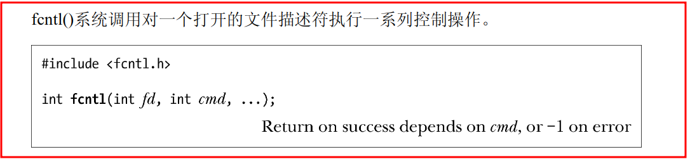
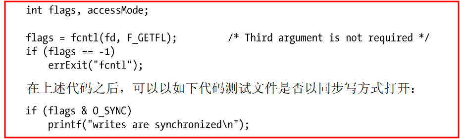

5.2——5.5
# 文件控制操作：fcntl()

>**int fcntl(int fd, int cmd, ...);**
- cmd: 控制操作，且所支持的操作范围很广
- ...：依据cmd 参数（如果有的话）的值来确定该参数的数据类型`有时候可以省略`

---
# 打开文件的状态标志
 - fcntl()的用途之一：针对一个打开的文件，`获取或修改`其**访问模式和状态标志**
     - *访问模式和状态标志*是通过指定open()调用的**flag 参数**来设置的
     - 要获取这些设置，将fcntl()的**cmd** 参数设置为**F_GETFL**
     - 
     - 注：针对一个打开的文件，*只有*通过open()或后续fcntl()的F_SETFL 操作，*才能*对该文件的状态标志进行设置

## 判定文件的访问模式
- 因为O_RDONLY(0)、O_WRONLY(1)和O_RDWR(2)这3 个常量并**不与**打开文件状态标志中的单个比特位对应
- 因此，要判定访问模式，需使用掩码O_ACCMODE 与flag **`相与`(&)**，将结果与3 个常量进行比对
- 
- 