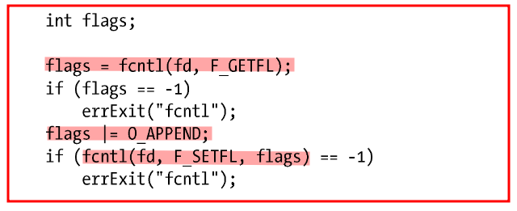

5.2——5.5
# 文件控制操作：fcntl()

>**int fcntl(int fd, int cmd, ...);**
- cmd: 控制操作，且所支持的操作范围很广
- ...：依据cmd 参数（如果有的话）的值来确定该参数的数据类型`有时候可以省略`

---
# 打开文件的状态标志
 - fcntl()的用途之一：针对一个打开的文件，`获取或修改`其**访问模式和状态标志**
     - *访问模式和状态标志*是通过指定open()调用的**flag 参数**来设置的
  
## 获取打开文件的状态标志(F_GETFL)
- 将fcntl()的**cmd** 参数设置为**F_GETFL**
- 
     - 注：针对一个打开的文件，*只有*通过open()或后续fcntl()的F_SETFL 操作，*才能*对该文件的状态标志进行设置

## 判定文件的访问模式
- 因为O_RDONLY(0)、O_WRONLY(1)和O_RDWR(2)这3 个常量并**不与**打开文件状态标志中的单个比特位对应
- 因此，要判定访问模式，需使用掩码O_ACCMODE 与flag **`相与`(&)**，将结果与3 个常量进行比对
- 
  

## 修改打开文件的状态标志(F_SETFL)
- 使用 fcntl()的 F_SETFL 命令来修改
- 允许更改的标志有O_APPEND、O_NONBLOCK、O_NOATIME、O_ASYNC 和O_DIRECT
- 适用场景:
    -  文件**不是**由调用程序打开的，所以程序也 **无法使用open()** 调用来控制文件的状态标志`(文件是 3 个标准输入输出描述符中的一员，这些描述符在程序启动之前就被打开)`
    -  文件描述符的获取是通过 **open()之外的系统调用** 
          -  例如：pipe()调用，该调用创建一个管道，并返回两个文件描述符分别对应管道的两端
          -  再比如：socket()调用，该调用创建一个套接字并返回指向该套接字的文件描述符
- 操作：
    1. 使用fcntl()的`F_GETFL` 命令来**获取当前标志的副本**
    2. **修改需要变更的比特位**
    3. 再次调用fcntl()函数的 `F_SETFL` 命令来**更新此状态标志**
    -  添加O_APPEND 标志的代码如下
   - 

---
# 文件描述符和打开文件之间的关系
- 多个文件描述符指向同一打开文件，这些文件描述符可在相同或不同的进程中打开
- 由内核维护的3 个数据结构：
    1. 进程级的**文件描述符表**
    2. 系统级的**打开文件表**
    3. 文件系统的**i-node 表**
   
## 打开文件的描述符（open file descriptor）表
- 该表的每一条目都记录了**单个文件描述符的相关信息**
    - 控制文件描述符操作的一组标志（仅定义了一个，即close-on-exec 标志）
    - 对打开文件句柄的引用

## 描述表格（open file description  table）- 打开文件表（open file table）
- 表中各条目称为打开文件句柄（open file handle）
- `一个打开文件句柄`存储了**与一个打开文件相关的全部信息**
    1. `当前文件偏移量`（调用read()和write()时更新，或使用lseek()直接修改）
    2. 打开文件时所使用的`状态标志`（即，open()的flags 参数）
    3. `文件访问模式`（如调用open()时所设置的只读模式、只写模式或读写模式）
    4. 与信号驱动I/O 相关的设置
    5. 对该文件`i-node 对象的引用`

## i-node 表
- 每个文件系统都会为驻留其上的**所有文件**建立一个 i-node 表
    1. `文件类型`（例如，常规文件、套接字或FIFO）和`访问权限`
    2. `一个指针`，指向该文件所持有的锁的列表
    3. `文件的各种属性`，包括文件大小以及与不同类型操作相关的时间戳

## 文件描述符、打开的文件句柄以及i-node 之间的关系

- 在`进程A` 中，文件`描述符1` 和`20` 都指向**同一个打开的文件句柄**（标号为23）。
    - 这可能是通过调用dup()、dup2()或fcntl()而形成的
- `进程A` 的文件`描述符2` 和`进程B `的文件`描述符2` 都指向**同一个打开的文件句柄**（标号为73）。
    - 这种情形可能在调用fork()后出现（即，进程A 与进程B 之间是父子关系）
    - 或者当某进程通过UNIX 域套接字将一个打开的文件描述符传递给另一进程时
- `进程A` 的`描述符0` 和`进程B` 的`描述符3` 分别指向**不同的打开文件句柄**，但这些句柄均指向**i-node 表中的相同条目**（1976）->>即**指向同一文件** 
    - 每个进程各自对同一文件发起了open()调用
    - 同一个进程两次打开同一文件

### 结论：
1. **两个不同的文件描述符，若指向同一打开文件句柄，将共享同一文件偏移量**
   - 因此，如果通过其中一个文件描述符来修改文件偏移量`（由调用 read()、write()或 lseek()所致）`，那么从另一文件描述符中也会观察到这一变化。`无论这两个文件描述符分属于不同进程，还是同属于一个进程`
2. **要获取和修改打开的文件标志**`（例如，O_APPEND、O_NONBLOCK 和 O_ASYNC）`，**可执行fcntl()的F_GETFL 和F_SETFL 操作**，
    - 其对作用域的约束与上一条颇为类似。
3. **文件描述符标志（*close-on-exec 标志*）为进程和文件描述符所私有。**
    - 对这一标志的修改将**不会影响**同一进程或不同进程中的其他文件描述符

---
# 复制文件描述符
- 