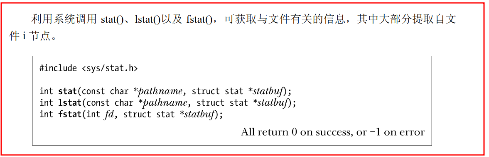
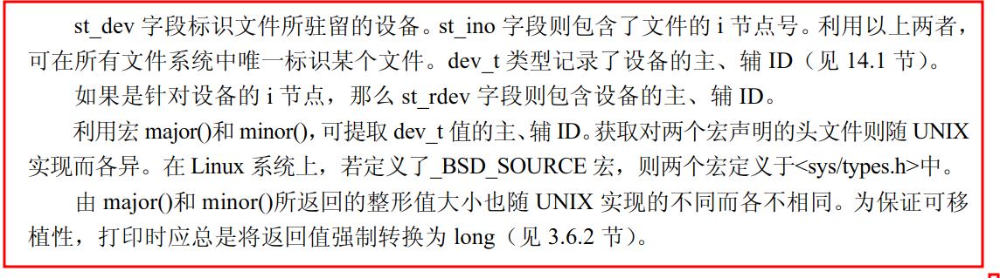

# 获取文件信息：stat()

> **int stat(const char * pathname, struct stat * statbuf);**
> **int lstat(const char * pathname, struct stat *  stabuf);**
> **int fstat(int fd, struct stat * statbuf);**
- 均获取与文件有关的信息，大部分提取自文件**i节点**
-  **stat()** 会返回**所命名文件的相关信息**
      - 将参数`pathname` 所指的文件状态, 复制到参数`statbuf` 所指的结构中。
      - pathname：文件路径（名）
      - statbuf：struct stat 类型的结构体
      - 返回值：成功返回0，失败返回-1
      - 下同
-   **lstat()** 与stat()类似
    - 区别在于如果文件属于符号链接，那么所返回的信息针对的是符号链接自身（而非符号链接所指向的文件）
- **fstat()** 返回由某个**打开文件描述符**所指代文件的相关信息
    - 将参数`fd` 所指的文件状态, 复制到参数`statbuf` 所指的结构中。
- 注：
    - stat() 和 lstat() 无需对其所操作的文件本身拥有任何权限，但针**对指定pathname 的父目录要有执行（搜索）权限**
    - fstat()只要供之以有效的文件描述符即可

  ##  stat 结构
- 上述所有系统调用都会在缓冲区中返回一个由statbuf 指向的stat 结构
```
struct stat
{
    dev_t     st_dev;     /* ID of device containing file */文件使用的设备号
    ino_t     st_ino;     /* inode number */    索引节点号 
    mode_t    st_mode;    /* protection */  文件对应的模式，文件，目录等
    nlink_t   st_nlink;   /* number of hard links */    文件的硬连接数  
    uid_t     st_uid;     /* user ID of owner */    所有者用户识别号
    gid_t     st_gid;     /* group ID of owner */   组识别号  
    dev_t     st_rdev;    /* device ID (if special file) */ 设备文件的设备号
    off_t     st_size;    /* total size, in bytes */ 以字节为单位的文件容量   
    blksize_t st_blksize; /* blocksize for file system I/O */ 包含该文件的磁盘块的大小   
    blkcnt_t  st_blocks;  /* number of 512B blocks allocated */ 该文件所占的磁盘块  
    time_t    st_atime;   /* time of last access */ 最后一次访问该文件的时间   
    time_t    st_mtime;   /* time of last modification */ /最后一次修改该文件的时间   
    time_t    st_ctime;   /* time of last status change */ 最后一次改变该文件状态的时间   
};
```
## 设备ID 和i 节点号


## 