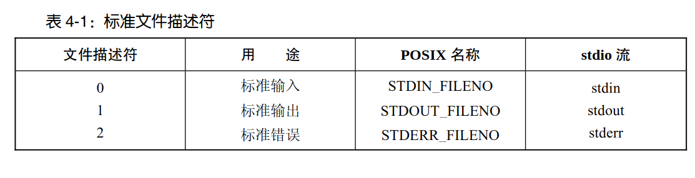
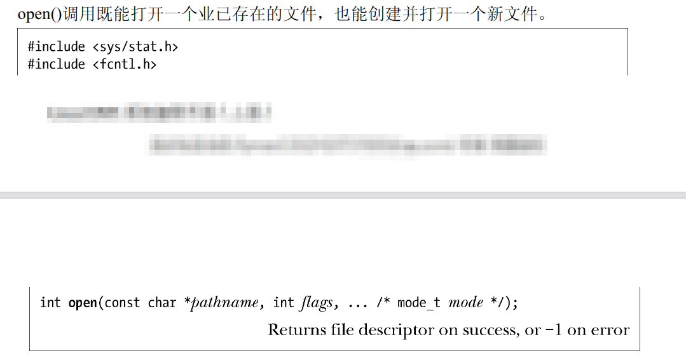
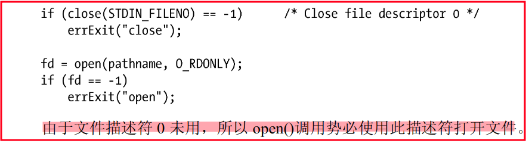
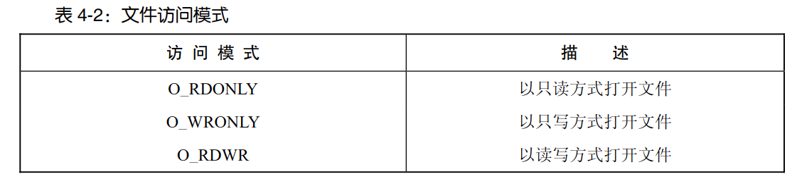
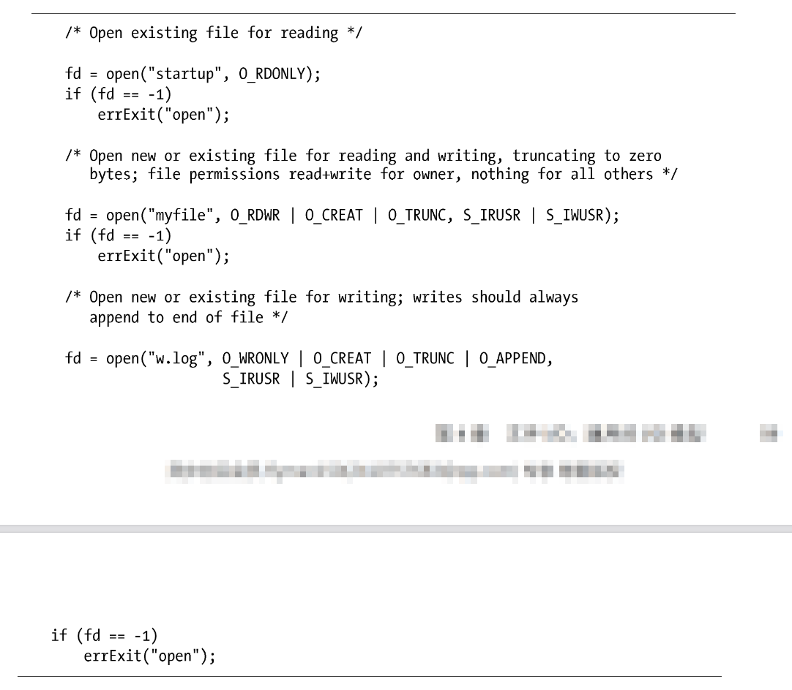
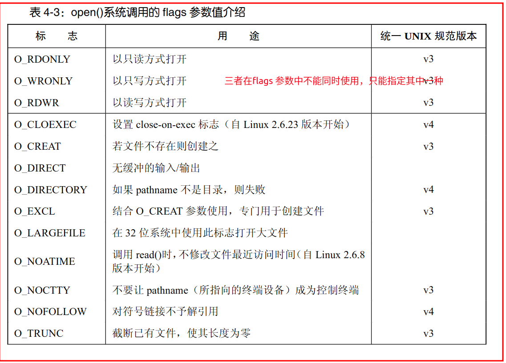
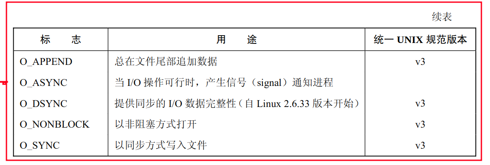
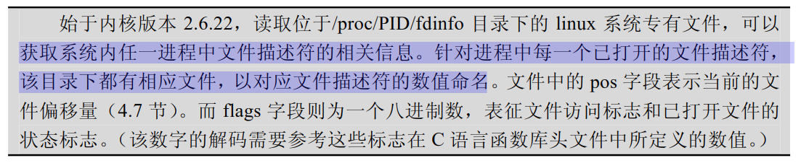
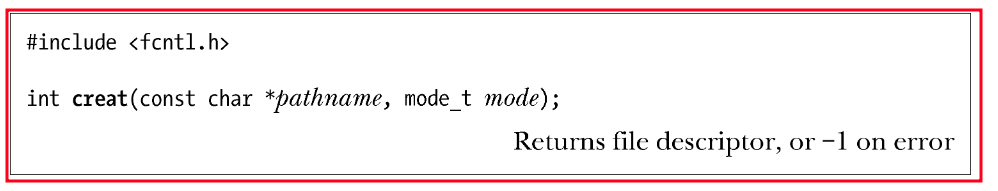
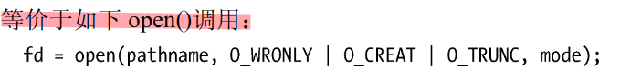

# 概述
- **文件描述符fd**（小的非负整数）
  - 指代打开的文件，用以表示所有类型的已打开文件（管道（pipe）、FIFO、socket、终端、设备和普通文件）
   - 可以使用数字（0、1、2）表示，或者采用<unistd.h>所定义的POSIX 标准名称
- **标准文件描述符**
    - 在程序开始运行之前，[shell](https://blog.csdn.net/qq_40964554/article/details/100899628?ops_request_misc=%257B%2522request%255Fid%2522%253A%2522167552686316800213069583%2522%252C%2522scm%2522%253A%252220140713.130102334..%2522%257D&request_id=167552686316800213069583&biz_id=0&utm_medium=distribute.pc_search_result.none-task-blog-2~all~top_positive~default-5-100899628-null-null.142^v73^wechat_v2,201^v4^add_ask,239^v1^insert_chatgpt&utm_term=shell&spm=1018.2226.3001.4187) 代表程序打开这3 个文件描述符，命令行有操作，shell会适当修改文件描述符
    - 

---
# 打开一个文件：open()
- 
> **fd = open(pathname, flags, mode)**  
  -  pathname :标识要打开的文件（若是链接，则引用）
  -  flags ：位掩码(八进制数），用于指定文件的**访问模式**
    
  -  mode ：调用 open()创建新文件时，位掩码参数 mode 指定了文件的**访问权限**（mode_t 属于整数类型）  
  -  返回值：成功-返回文件描述符，失败-返回-1并将errno 置为相应的错误标志 
     - 如果调用 open()成功，必须保证其返回值为进程未用文件描述符中数值最小者。可以利用该特性以特定文件描述符打开某一文件
     - 失败的部分错误原因见63～64页
  -  
  - 

## flags 参数
- 可参与flags 参数逐位**或运算（|）**
- **文件访问模式标志**：O_RDONLY、O_WRONLY 和O_RDWR 
- **文件创建标志**:位于第二部分,不能检索，也无法修改.
- **已打开文件的状态标志**(文件状态标志):表4-3 中的剩余部分,使用fcntl()的F_GETFL 和F_SETFL 操作可以分别检索和修改此类标志
    - (flags 常量的详细描述见61～63页)
- 
- 
- 

## creat()系统调用
- 在早期的UNIX 实现中，open()只有两个参数，无法创建新文件，而是使用creat()系统调用来创建并打开一个新文件
- 
- 若文件已存在，则打开文件，并**清空**文件内容，将其长度清 0
- 