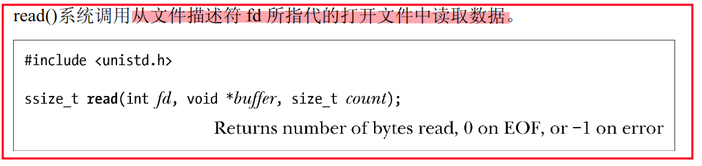
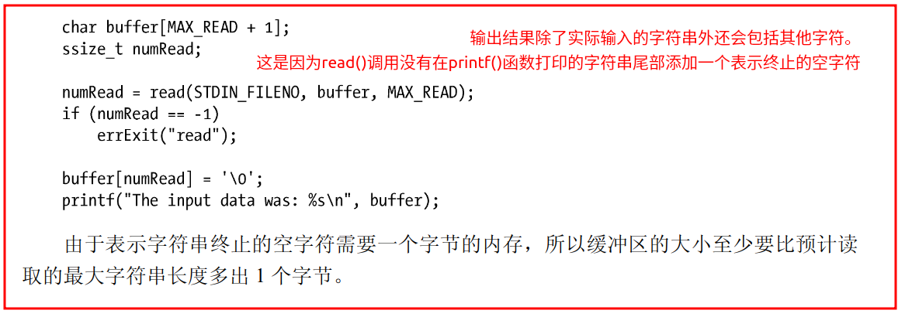
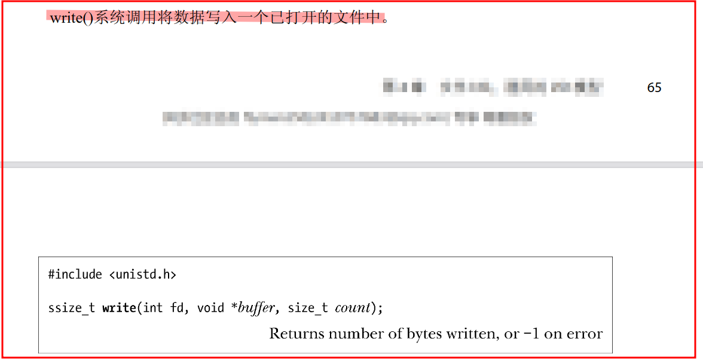
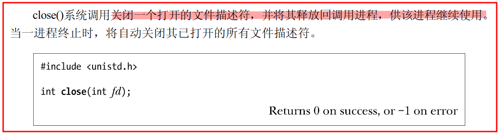
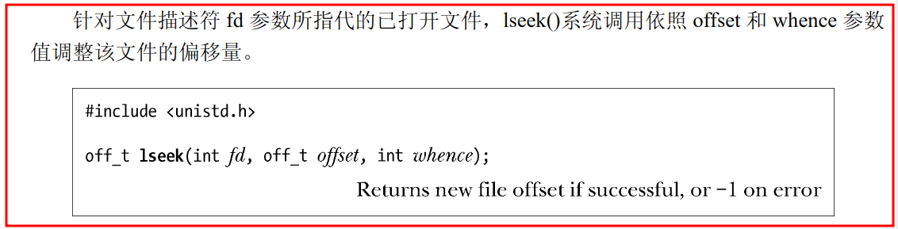
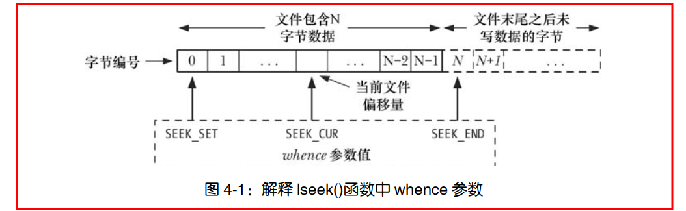
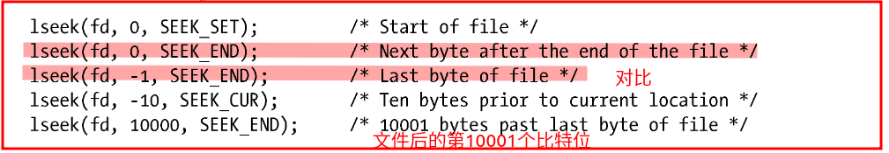
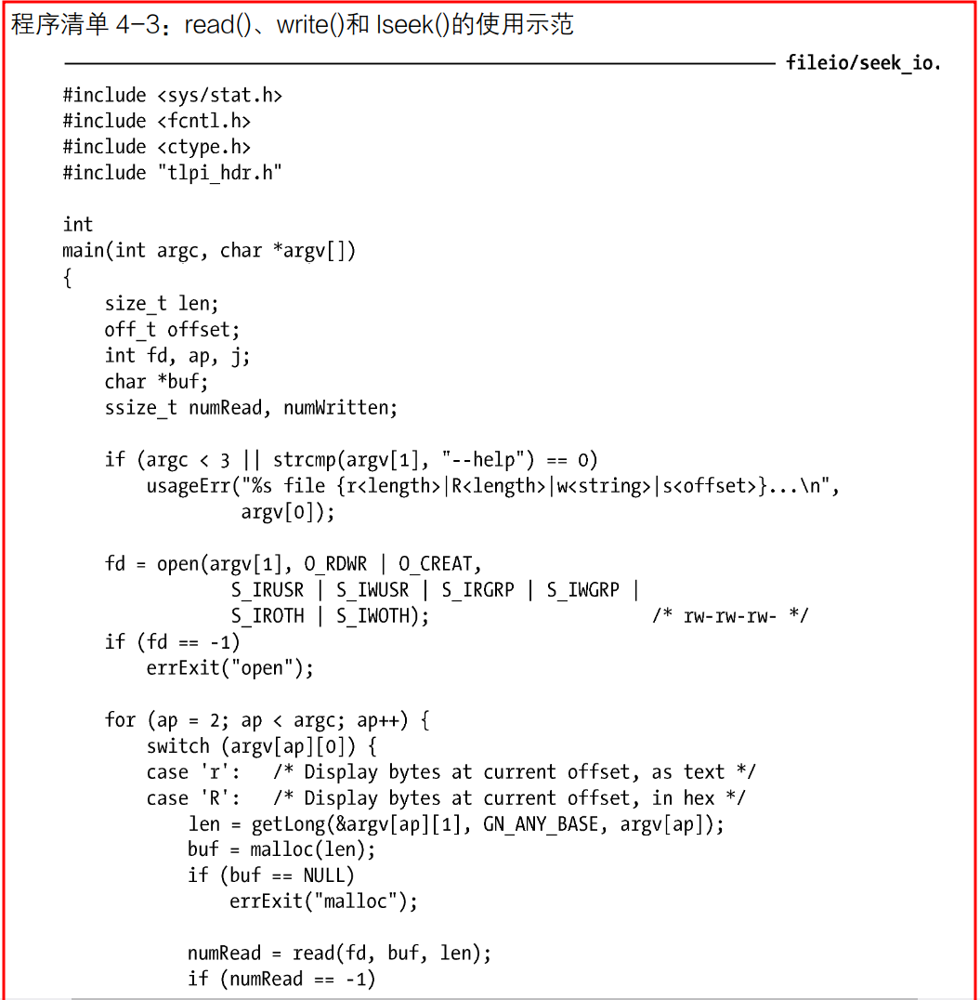
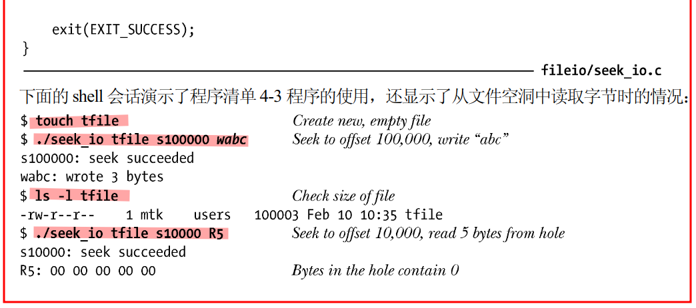
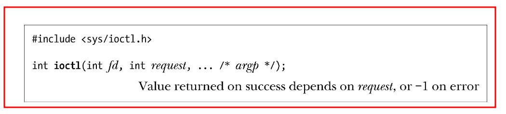

- [概述](#概述)
- [打开一个文件：open()](#打开一个文件open)
  - [flags 参数](#flags-参数)
  - [creat()系统调用](#creat系统调用)
- [读取文件内容：read()](#读取文件内容read)
- [数据写入文件：write()](#数据写入文件write)
- [关闭文件：close()](#关闭文件close)
- [改变文件偏移量：lseek()](#改变文件偏移量lseek)
  - [文件空洞](#文件空洞)
  - [示例程序](#示例程序)
- [通用I/O 模型以外的操作：ioctl()](#通用io-模型以外的操作ioctl)
- [总结](#总结)

# 概述
- **文件描述符fd**（小的非负整数）
  - 指代打开的文件，用以表示所有类型的已打开文件（管道（pipe）、FIFO、socket、终端、设备和普通文件）
   - 可以使用数字（0、1、2）表示，或者采用<unistd.h>所定义的POSIX 标准名称
- **标准文件描述符**
    - 在程序开始运行之前，[shell](https://blog.csdn.net/qq_40964554/article/details/100899628?ops_request_misc=%257B%2522request%255Fid%2522%253A%2522167552686316800213069583%2522%252C%2522scm%2522%253A%252220140713.130102334..%2522%257D&request_id=167552686316800213069583&biz_id=0&utm_medium=distribute.pc_search_result.none-task-blog-2~all~top_positive~default-5-100899628-null-null.142^v73^wechat_v2,201^v4^add_ask,239^v1^insert_chatgpt&utm_term=shell&spm=1018.2226.3001.4187) 代表程序打开这3 个文件描述符，命令行有操作，shell会适当修改文件描述符
    - 

---
# 打开一个文件：open()
- 
> **fd = open(pathname, flags, mode)**  
  -  pathname :标识要打开的文件（若是链接，则引用）
  -  flags ：位掩码(八进制数），用于指定文件的**访问模式**
    
  -  mode ：调用 open()创建新文件时，位掩码参数 mode 指定了文件的**访问权限**（mode_t 属于整数类型）  
  -  返回值：成功-返回文件描述符，失败-返回-1并将errno 置为相应的错误标志 
     - 如果调用 open()成功，必须保证其返回值为进程未用文件描述符中数值最小者。可以利用该特性以特定文件描述符打开某一文件
     - 失败的部分错误原因见63～64页
  -  
  - 

## flags 参数
- 可参与flags 参数逐位**或运算（|）**
- **文件访问模式标志**：O_RDONLY、O_WRONLY 和O_RDWR 
- **文件创建标志**:位于第二部分,不能检索，也无法修改.
- **已打开文件的状态标志**(文件状态标志):表4-3 中的剩余部分,使用fcntl()的F_GETFL 和F_SETFL 操作可以分别检索和修改此类标志
    - (flags 常量的详细描述见61～63页)
- 
- 
- 

## creat()系统调用
- 在早期的UNIX 实现中，open()只有两个参数，无法创建新文件，而是使用creat()系统调用来创建并打开一个新文件
- 
- 若文件已存在，则打开文件，并**清空**文件内容，将其长度清 0
- 

---
# 读取文件内容：read()

>**numread = read(fd, buffer, count)**
- 调用从fd 所指代的打开文件中读取至多count **字节**的数据，并**存储**到buffer 中
- bufer：存放输入数据的**内存缓冲区地址**，至少应有**count +1** 个字节
- count：指定最多能读取的字节数（size_t 数据类型：无符号整数类型）
- 返回值：实际读取到的字节数
    - 再无字节可读（例如：读到文件结尾符EOF 时），则返回值为0
    - 出现错误则返回-1
    - ssize_t 数据类型：有符号的整数类型，用来存放（读取的）字节数或-1（表示错误）。
- 从终端读取字符，一遇到换行符（\n），read()调用就会结束
- 

---
# 数据写入文件：write()

>**numwritten = write(fd, buffer, count)**
- 从buffer 中读取多达count 字节的数据写入由fd 所指代的已打开文件中
- buffer：要写入文件中数据的**内存地址**
- count：欲从buffer 写入文件的数据字节数
- 返回值：实际写入文件中的字节数，且有可能小于count。
    -  write()调用成功并**不能**保证数据已经写入磁盘
  
---
# 关闭文件：close()

>**status  =  close(fd)**
- 所有输入/输出操作完成后，调用close()，释放文件描述符fd 以及与之相关的内核资源。
- 报错:关闭一个未打开的文件描述符，两次关闭同一文件描述符,特定文件系统在关闭操作中诊断出的错误条件( NFS 出现提交失败，意味着数据没有抵达远程磁盘)
- 

---
# 改变文件偏移量：lseek() 
- 概念：指执行下一个read()或write()操作的**文件起始位置**，会以相对于文件头部起始点的文件当前位置来表示，`文件第一个字节的偏移量为0`
- 每次read()或write()调用将自动对其进行调整，以指向已读或已写数据后的**下一字节**，`因此，连续的read()和write()调用将按顺序递进，对文件进行操作`
- 
- >**off_t lseek(int fd, off_t offset, int whence);**
- offset:一个以**字节为单位**的数值
    -  off_t 数据类型为有符号整型数
- whence:应参照哪个基点来解释offset 参数
- 返回值：成功：返回新的文件偏移量
- 注：**不允许**将lseek()应用于管道、FIFO、socket 或者终端
- 
    - 
    - 注：相对于文件头部的绝对偏移量=当前文件偏移量+offset。
- 应用：获取文件偏移量的当前位置
    - 
    - 将文件偏移量移到的具体位置
        - 

## 文件空洞
- 如果程序的文件偏移量已然跨越了文件结尾，然后再执行I/O 操作
    - read()调用将返回0，表示文件结尾。
    - write()函数可以在文件结尾后的任意位置写入数据。
- `从文件结尾后到新写入数据间的这段空间被称为文件空洞`
- 文件空洞中**存在字节**的，读取空洞将返回以0（空字节）填充的缓冲区
- 但，文件空洞**不占用任何磁盘空间**（直至在文件空洞中写入了数据，才...）
- 常见例子：`核心转储文件（core  dump）`

## 示例程序
  
  
  
  

---
# 通用I/O 模型以外的操作：ioctl() 

- request ：指定将在fd 上执行的控制操作
    - 具体设备的头文件定义了可传递给request 参数的常量
- 第三个参数（...）：`称之为argp`，可以是任意数据类型根据 ，request 的参数值来确定 argp 所期望的类型（一般是指向整数或结构的**指针**）

---
# 总结
- 对普通文件执行 I/O 操作，
    - 首先调用 **open()** 以获得一个文件描述符
    - 随之使用 **read()和 write()** 执行文件的 I/O 操作
    - 然后应使用 **close()** 释放文件描述符及相关资源。
    - 这些系统调用可对所有类型的文件执行I/O 操作
- 对于已打开的每个文件，内核都维护有一个**文件偏移量**，这决定了下一次读或写操作的起始位置
    - 读和写操作会隐式修改文件偏移量
    - 使用 **lseek()** 函数可以显式地将文件偏移量置为文件中或文件结尾后的任一位置
    - 在文件原结尾处之后的某一位置写入数据将导致**文件空洞**