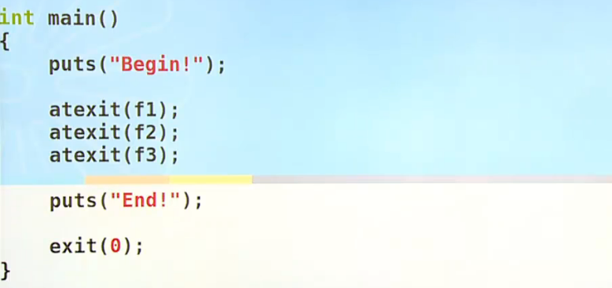
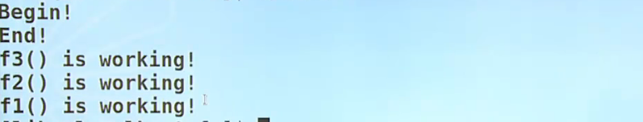
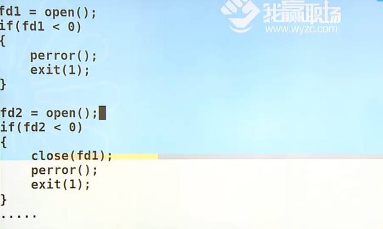
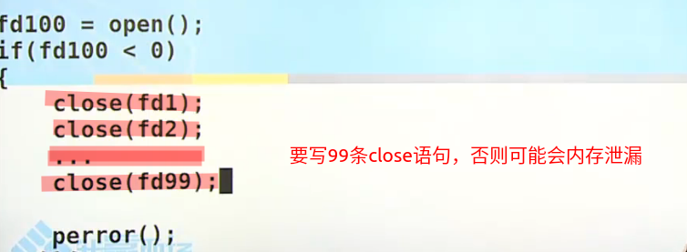
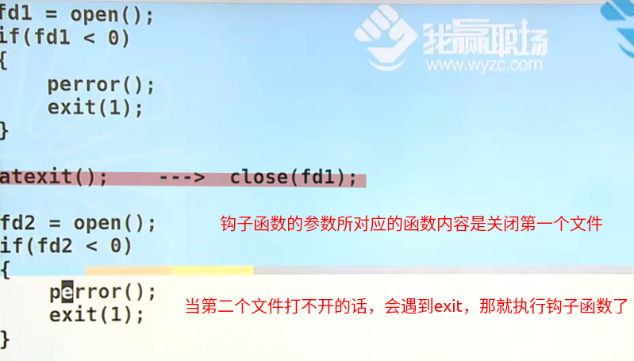

# 进程环境（单进程）

1. main函数
   * int main(int argc,char *argv[])
   * 当前进程的入口/出口
2. 进程的终止（五三）
   * 正常终止
   * 异常终止：
     1. 调用abort函数（发送信号给当前进程，杀掉当前进程，并得到一个文件）
     2. 接到一个信号并终止（如Ctrl+C）
     3. 最后一个线程对其取消请求作出相应
3. 命令行参数的分析
4. 环境变量
   * 原来是main函数的第三个参数
5. C程序的存储空间的分布
6. 库
7. 函数跳转
8. 资源的获取及控制

## 进程的终止

## 正常终止

1. **从main函数返回**（return 0）
   * return 0 **是给当前进程的副进程看的**
   * 我是通过命令行gcc，./a.out执行.c文件，那副进程就是shell
   * 通过echo $?打印上条语句的执行状态，结果为0，
   * 若没有return 0，则结果为最后一条语句的返回值
2. **调用exit**（exit(0)）
   * 钩子函数atexit
3. **调用_exit或_Exit**
   * exit依赖于_exit或_Exit
   * 不会执行钩子函数
4. **最后一个线程从其启动例程返回**（启动例程：一个线程本身）
5. **最后一个线程调用pthread_exit函数**（相当于进程的exit）

> **`void exit(int status)`**
>
> - #incldue<stdlib.h>

> **`int atexit(void (*function)(void))`**
>
>
> #include <stdlib.h>
>
>
> - 钩子函数（**遇到一个atexit，就给他挂到钩子上**，所有都挂完后按照**后进先出**原则进行函数的调用）
> - 一个进程正常终止之前(**即将执行exit之前**)会调用钩子函数去**释放所有该释放的内容**
> - void (*function)(void)：钩子函数的参数是一个参数和返回值都为void的函数的函数名
> - 
> - 
> - 实际用途：（要成功打开多个文件，如果有打不开的，就要关闭之前打开的所有文件且进行报错，并终止该进程）
>
>   - 有用到**open,malloc等申请资源的操作**后，就可以用钩子函数，**防止内存泄漏**
>
>   
>
>   没用钩子函数就太麻烦了
>
>   
>
>   

> **`void _exit(int status);`**
>
> #include <unistd.h>
>
> **`void _Exit(int status);`**
>
> #include <stdlib.h>
>
> - 函数调用返回之值该是1/2/0三种情况，但却出现了第四种情况，说明程序有故障
> - 若用exit，则会调用钩子函数、刷新/同步IO...会将故障进一步扩大
> - 此时应该调用_exit或_Exit，什么都不做，直接退出
>
