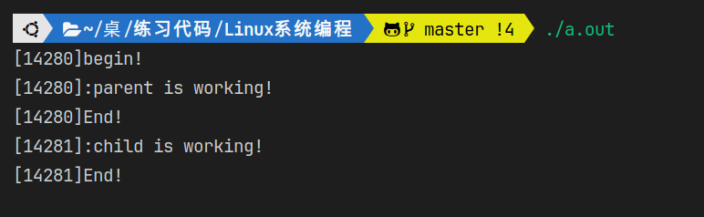
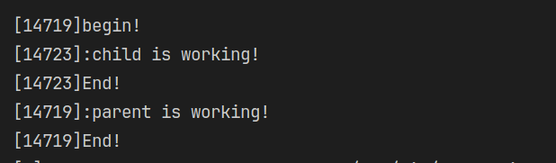

# 进程

1. 进程标识符pid

   * 类型pid_t
   * 命令ps
   * 进程号是顺次向下使用
2. 进程的产生

   * fork()

   - vfork()
3. 进程的消亡及释放资源
4. exec函数族
5. 用户权限、组权限
6. 观摩课：解释器文件
7. system（）
8. 进程会计
9. 进程时间
10. 守护进程
11. 系统日志

---

## 进程标识符pid

- 获得**当前进程的进程号**：getpid（）  -> p = process
- 获得**父进程的进程号**：getppid（）  -> pp = parent process

> **`pid_t getpid(void); `**
>
> **`pid_t getppid(void);`**
>
> #include <sys/types.h>
> #include <unistd.h>

---

## 进程的产生

- fork()
- 关键字：复制  -> 意味着拷贝、克隆、**一模一样**  -> 连**执行到的位置也一样**！！！
- fork后父子进程的区别：
  - **fork的返回值不一样，pid不同，ppid也不同**（**子进程的ppid=父进程pid**）
  - 未决信号和文件锁不继承，资源利用量清0
- init进程：1号，是所有进程的祖先进程
- **调度器的调度策略来决定哪个进程先运行**  ->因此运行结果会有时child先，有时parent先
- fflush()的重要性

> **`pid_t fork(void);`**
> #include <sys/types.h>
> #include <unistd.h>
>
> - 返回值：
>
>   - On success, the PID of the child process is returned in the parent, and 0 is returned in the child.
>   - On failure, -1 is returned in the parent, no child process
>     is created
> - ```c
>   #include <stdio.h>
>   #include <sys/types.h>
>   #include <unistd.h>
>   #include <stdlib.h>
>
>   int main()
>   {
>       pid_t pid;
>
>       printf("[%d]begin!\n", getpid());
>
>       fflush(NULL);  //在fork之前刷新所有成功打开的流，否则将输出重定向到一个文件里时，会出现两个“begin” ！！！
>                     //因为“begin”放到缓冲区当中，还没来得及写到文件里去就已经fork，导致父子缓冲区里各自有一个“begin”
>                     //且begin带的进程号已经是固定了，为fork前父进程的进程号
>       pid = fork();
>       if (pid < 0)
>       {
>           perror("fork()");
>           exit(1);
>       }
>
>       if (pid == 0) // child
>       {
>           printf("[%d]:child is working!\n", getpid());
>       }
>       else // parent
>       {
>           //sleep(1);  ->取消注释后：让父进程等1s，子进程先运行
>           printf("[%d]:parent is working!\n", getpid());
>       }
>
>       printf("[%d]End!\n", getpid());
>
>       exit(0);
>   }
>   ```
> - 结果：
>   
> - 或
>
>   
